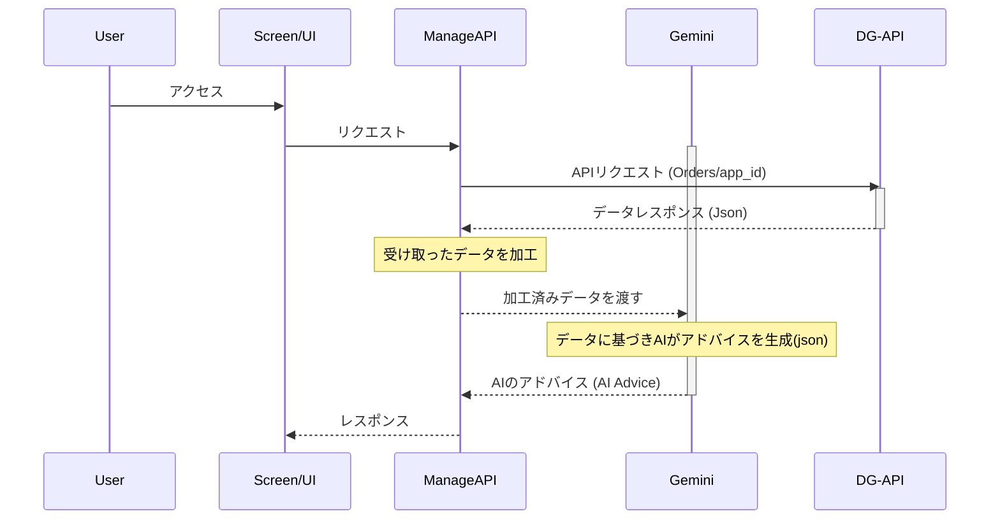

```mermaid
sequenceDiagram
participant User
participant 画面 as Screen/UI
participant ManageAPI
participant Gemini
participant DG-API

    User->>画面: アクセス
    画面->>ManageAPI: リクエスト

    activate Gemini
    ManageAPI->>DG-API: APIリクエスト (Orders/app_id)
    activate DG-API
    DG-API-->>ManageAPI: データレスポンス (Json)
    deactivate DG-API

    note over ManageAPI: 受け取ったデータを加工

    ManageAPI-->>Gemini: 加工済みデータを渡す

    note over Gemini: データに基づきAIがアドバイスを生成(json)

    Gemini-->>ManageAPI: AIのアドバイス (AI Advice)
    deactivate Gemini

    ManageAPI-->>画面:　レスポンス
```
